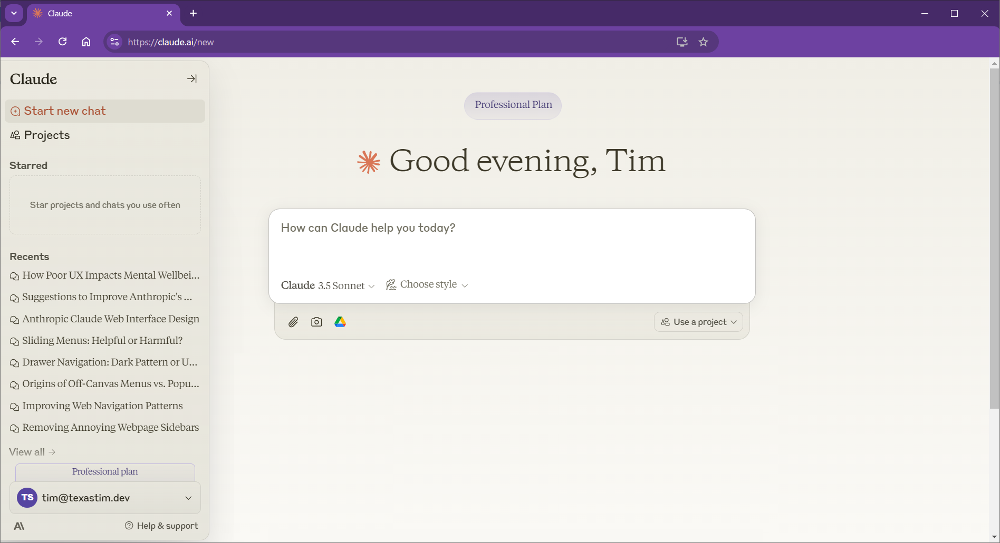
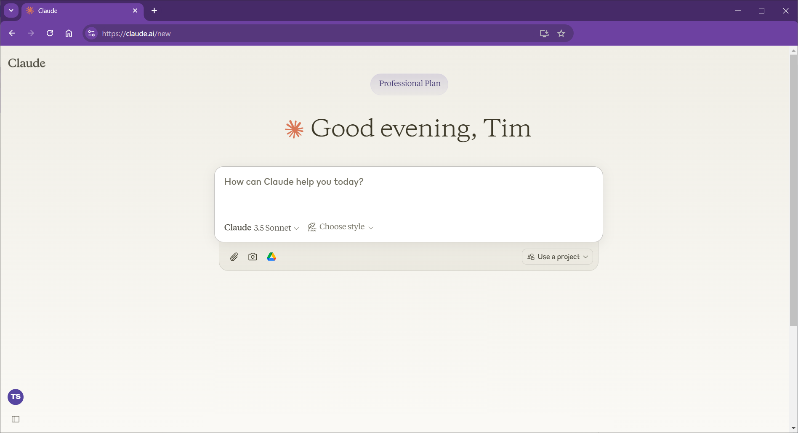
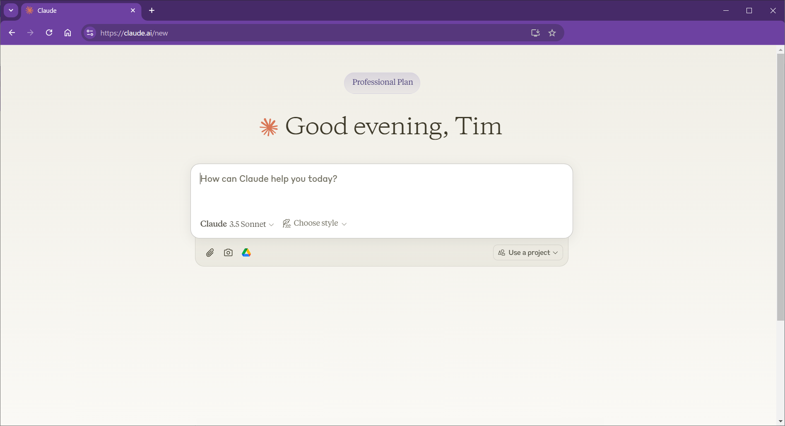

# Bookmarklet to delete Claude.ai's sliding sidebar

This 1-liner Javascript bookmarklet deletes Claude's annoying lefthand sidebar
from the current DOM of the claude.ai chat web page you're on.

The bookmarklet comes with some guardrails.
The bookmarklet verifies that the current web page
is on the claude.ai domain
and that it has a URL path starting with "/chat/" or "/new"
before it will try to delete the sidebar.
For example, the bookmarklet will do nothing
if you're on [https://claude.ai/settings/profile](https://claude.ai/settings/profile),
since that URL path does not start with "/chat/" or "/new".

## Motivation

The hair-trigger activation of the claude.ai chat page's lefthand sidebar is extremely distracting for me.
So I created a bookmarklet button to nuke it from orbit.
My user experience on the claude.ai chat web page is sooo much better without the sidebar.
And anyway, restoring the sidebar is as easy as Control-R to reload the web page and get a fresh DOM while still keeping the current chat open.

## Compatibility

The bookmark seems to operate as intended on recent versions of Chrome and Firefox.

## Installation

1. Create a new bookmark in your web browser.
For example, in Chrome you can click the star icon on the far right end of the address bar to create a bookmark for the web page you're on.
What you bookmark doesn't matter, because we are going to modify this bookmark in the very next step.

2. Now let's modify the bookmark we created in the previous step.
(In Chrome and Firefox you can right-click on the bookmark and choose Edit.)
Replace the URL in the bookmark's URL field with the Javascript shown below.
You can also find this code snippet in the `delete-claude-sidebar-via-bookmarklet.js` file in this repo.
   ```javascript
   javascript: (function() { if (window.location.hostname === 'claude.ai' && (window.location.pathname.startsWith('/chat/') || window.location.pathname.startsWith('/new'))) { document.querySelector('[data-testid="menu-sidebar"]').remove(); } return void 0; })();
   ```

3. Save the modified bookmark. You're all set!

## Usage

When you're on a chat page on [claude.ai](https://claude.ai), click on the bookmarklet to delete the sidebar.

## Screenshots

Here is a screenshot of the claude.ai chat interface showing the sidebar expanded:



---

Here is a screenshot of the claude.ai chat interface with the sidebar collapsed:



---

Here is a screenshot of the claude.ai chat interface after the sidebar has been deleted via the bookmarklet.
(Side note: the "Claude" logotype in the upper left corner of the page is also gone.)



## FAQs

Q: I deleted the chat history sidebar. But how do I get it back?

A: The bookmarklet deletes the sidebar element from the current web page DOM only.
If you reload the web page (e.g., via Control-R), the sidebar will be back as usual.
Or if you open a new tab or window and navigate to [claude.ai](https://claude.ai) or [claude.ai/new](https://claude.ai/new), the sidebar will also be back as usual.

---

Q: What side effects does deleting the sidebar have the normal operation of the chat interface?

A: I've been deleting the sidebar pretty consistently during daily usage for about 6 weeks now,
and there have been no undesirable side effects that I have noticed.

---

Q: What happens if Anthropic changes the name of the `data-testid` attribute or the value `menu-sidebar` in the future?

A: The bookmarklet queries specifically for `data-testid="menu-sidebar"`,
so if this attribute name or its associated value changes,
the selector won't be able to find the sidebar and consequently won't be able to delete it.
The selector string would have to be updated so it finds the sidebar again.
If the bookmarklet doesn't find an element matching the selector, it simply does nothing.

## Forks and Contributions

Fork away! Contributions to this repo via issue and pull request are also welcome.

## License

[MIT License](https://mit-license.org/)

## Disclaimer

This bookmarklet is provided as-is, without any guarantees that it will always work.
Claude.ai's web page structure may change at any time,
which may affect the bookmarklet's functionality.
